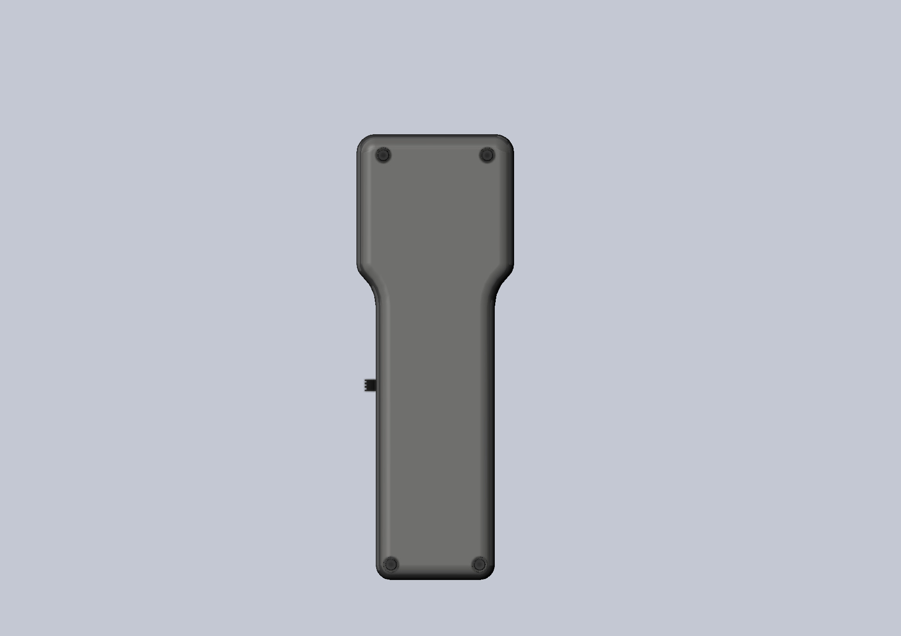
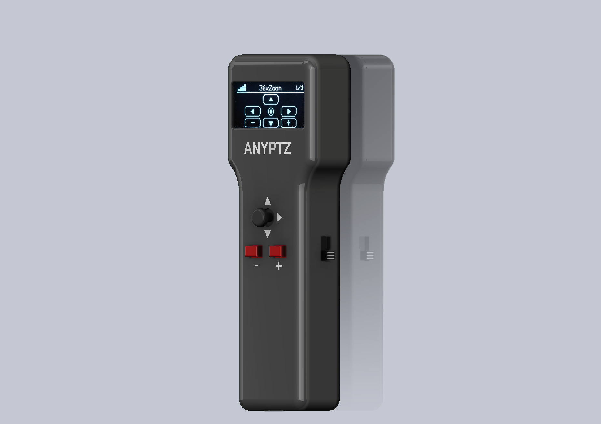
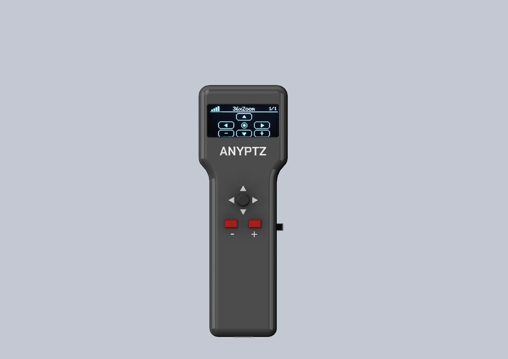
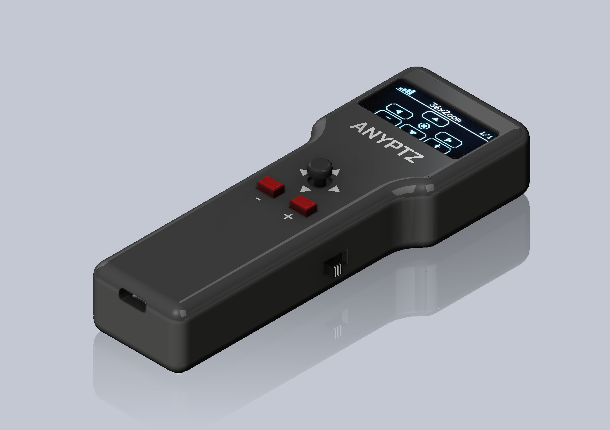
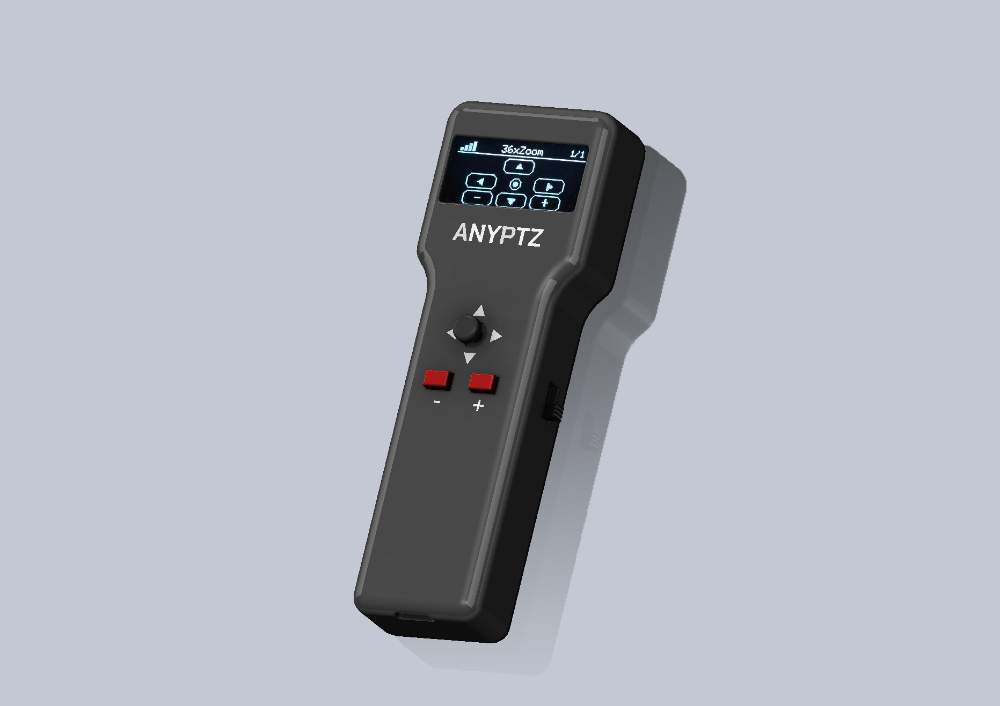

# AnyPTZ-FW

Turn almost any PTZ surveillance camera into a fully wireless, portable control system with AnyPTZ - a compact DIY controller designed for enthusiasts, makers, installers, and security professionals.

AnyPTZ supports multiple popular PTZ protocols including ONVIF, XMeye, Dahua, Hikvision and many others, allowing you to control different camera brands from a single handheld device.

## Features

- Universal PTZ control for multiple camera protocols
- Portable and battery-powered operation
- Compact pocket-sized design
- Built-in OLED display for status and control information
- Wi-Fi connectivity for wireless operation
- Convenient USB Type-C charging
- Integrated battery charging protection
- Modern web interface for setup and remote control
- Fully DIY-friendly project

Whether you're building a mobile surveillance station, testing cameras in the field, or just want a sleek standalone PTZ controller, AnyPTZ gives you flexibility without bulky equipment or complicated software.

The project combines practical hardware design with a clean wireless interface, making it ideal for:

- CCTV installers
- Smart home enthusiasts
- Security researchers
- DIY electronics makers
- Makerspace projects

Assemble it yourself, customize it for your workflow, and control your cameras anywhere over Wi-Fi.

## Device Photos

## Assembly Guide

### Required Components

- ESP32 Lolin32 Lite
- 1.3" OLED I2C display
- 5D joystick module with 2 push buttons
- TP4056 charging module with protection
- 3.7V Li-ion battery
- Mechanical power switch
- Wires and soldering tools

### 5D Joystick with 2 buttons

- UP -> GPIO32
- DOWN -> GPIO33
- LEFT -> GPIO25
- RIGHT -> GPIO26
- PRESS -> GPIO27
- Zoom + -> GPIO16
- Zoom - -> GPIO17

Connect the joystick GND to ESP32 GND.

### Connect the OLED display using I2C

- SDA -> GPIO19
- SCL -> GPIO23
- VCC -> 3.3V
- GND -> GND

### TP4056 Module

The project uses a TP4056 charging board with battery protection.

#### Battery Connection

- Battery positive -> B+
- Battery negative -> B-

#### ESP32 Power Connection

Connect OUT+ and OUT- from the TP4056 through a mechanical power switch.

After the switch:

- Positive wire -> VIN/5V/BAT input on ESP32 board (board-dependent)
- Negative wire -> GND pin on ESP32

Important: do not feed raw Li-ion voltage (up to 4.2V) directly into a 3V3 pin.
If your board exposes only a 3V3 power input, use an external 3.3V regulator.

## Firmware Package (No Sources)

This repository contains release-only files:

- Ready-to-use OTA files in `firmware/ota`
- Full first-flash binaries for a new MCU in `firmware/fullflash`
- GUI uploader package in `firmware/uploader`
- Integrity hashes in `firmware/SHA256SUMS.txt`

## Flashing and First Start

Detailed guide for a brand-new microcontroller, OTA updates, serial flashing commands, and troubleshooting:

- [Firmware flashing guide](docs/FLASHING.md)

After assembly:

1. Download firmware from this repository.
2. Upload the firmware to ESP32.
3. Power on the device.
4. Connect to Wi-Fi.
5. Open the web interface at `http://192.168.1.1`.
6. Add your Wi-Fi and control your PTZ cameras.

## Small. Wireless. Universal.

**This is AnyPTZ.**
